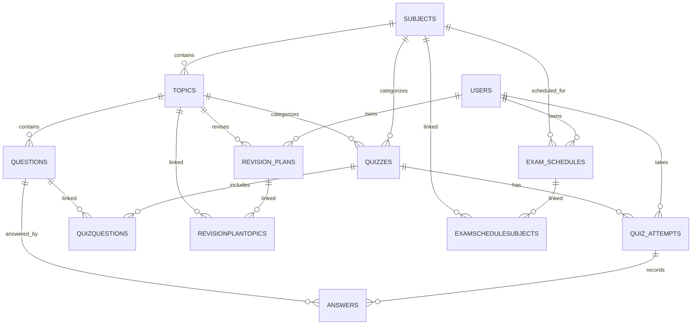

# Database Design

## Entity relationship diagram

This is a logical association diagram. The columns below reflect the inspected MySQL schema. It is a snapshot, not a guarantee that every installation has the same migration state.

## Physical schema

All ordinary tables have `id INT UNSIGNED AUTO_INCREMENT PRIMARY KEY` and Sequelize timestamps `created_at DATETIME NOT NULL`, `updated_at DATETIME NOT NULL`. The three join tables use composite primary keys and timestamps instead of `id`.

| Table | Other columns and observed types/null/default | Keys and notes |
|---|---|---|
| `users` | `name VARCHAR(120) NOT NULL`; `email VARCHAR(254) NOT NULL`; `password VARCHAR(255) NULL`; `role ENUM(student,teacher,admin) NOT NULL DEFAULT student`; `email_verified TINYINT(1) NOT NULL DEFAULT 0`; `email_verification_token VARCHAR(64) NULL`; `email_verification_expires DATETIME NULL`; `password_reset_token VARCHAR(64) NULL`; `password_reset_expires DATETIME NULL`; `google_id VARCHAR(128) NULL`; `auth_provider VARCHAR(32) NOT NULL DEFAULT local` | Unique `email`, unique nullable `google_id` |
| `subjects` | `name VARCHAR(120) NOT NULL`; `description TEXT NULL` | No unique name index observed |
| `topics` | `name VARCHAR(160) NOT NULL`; `description TEXT NULL`; `subject_id INT UNSIGNED NULL` | FK subject_id → subjects.id |
| `questions` | `prompt TEXT NOT NULL`; `type VARCHAR(40) NOT NULL DEFAULT multiple_choice`; `options JSON NULL`; `correct_answer TEXT NULL`; `explanation TEXT NULL`; `difficulty ENUM(easy,medium,hard) NOT NULL DEFAULT medium`; `topic_id INT UNSIGNED NULL` | FK topic_id → topics.id |
| `quizzes` | `title VARCHAR(180) NOT NULL`; `description TEXT NULL`; `subject_id INT UNSIGNED NULL`; `topic_id INT UNSIGNED NULL`; `time_limit INT UNSIGNED NULL`; `is_published TINYINT(1) NOT NULL DEFAULT 0` | FK subject_id → subjects.id; no physical FK on topic_id observed |
| `quiz_attempts` | `user_id INT UNSIGNED NULL`; `quiz_id INT UNSIGNED NULL`; `started_at DATETIME NULL`; `completed_at DATETIME NULL`; `score DECIMAL(7,2) NULL`; `total_questions INT UNSIGNED NOT NULL DEFAULT 0`; `correct_answers INT UNSIGNED NOT NULL DEFAULT 0`; `wrong_answers INT UNSIGNED NOT NULL DEFAULT 0`; `percentage DECIMAL(5,2) NOT NULL DEFAULT 0`; `status ENUM(in_progress,completed) NOT NULL DEFAULT in_progress` | FKs user_id → users.id, quiz_id → quizzes.id |
| `answers` | `quiz_attempt_id INT UNSIGNED NULL`; `question_id INT UNSIGNED NULL`; `response TEXT NULL`; `is_correct TINYINT(1) NULL` | FKs to quiz_attempts and questions |
| `revision_plans` | `user_id INT UNSIGNED NULL`; `topic_id INT UNSIGNED NULL`; `title VARCHAR(180) NOT NULL`; `starts_at DATETIME NULL`; `ends_at DATETIME NULL`; `status ENUM(pending,completed) NOT NULL DEFAULT pending`; `completed_at DATETIME NULL`; `completed_after_attempt_id INT UNSIGNED NULL` | FKs user_id → users.id, topic_id → topics.id; unique `(user_id, topic_id)`; completed_after_attempt_id had no FK observed |
| `exam_schedules` | `user_id INT UNSIGNED NULL`; `subject_id INT UNSIGNED NULL`; `title VARCHAR(180) NULL`; `exam_at DATETIME NOT NULL`; `location VARCHAR(180) NULL`; `status ENUM(upcoming,completed) NOT NULL DEFAULT upcoming`; `notes TEXT NULL` | FKs to users and subjects; unique `(user_id, subject_id, exam_at)` |
| `quizquestions` | `quiz_id INT UNSIGNED NOT NULL`; `question_id INT UNSIGNED NOT NULL` | Composite PK `(quiz_id, question_id)`; FKs to quizzes/questions |
| `revisionplantopics` | `revision_plan_id INT UNSIGNED NOT NULL`; `topic_id INT UNSIGNED NOT NULL` | Composite PK `(revision_plan_id, topic_id)`; FKs to revision_plans/topics; currently unused by revision flow |
| `examschedulesubjects` | `exam_schedule_id INT UNSIGNED NOT NULL`; `subject_id INT UNSIGNED NOT NULL` | Composite PK `(exam_schedule_id, subject_id)`; FKs to schedules/subjects; currently unused by exam flow |

## Relationships and constraints

- Subject has many Topics and Quizzes; Topic has many Questions.
- Quiz has many Questions through `quizquestions`.
- User has many QuizAttempts, RevisionPlans and ExamSchedules.
- QuizAttempt has many Answers; each Answer references a Question.
- Current revision flow uses direct `revision_plans.topic_id`; current exam flow uses direct `exam_schedules.subject_id`.
- Unique indexes observed: users.email, users.google_id, revision_plans(user_id, topic_id), exam_schedules(user_id, subject_id, exam_at), and each join table's composite key. Subject/topic name uniqueness is checked by application logic where applicable, but no unique DB index was observed.

## Schema caveats

Several legacy physical FK columns are nullable (`topics.subject_id`, `questions.topic_id`, and some owner/parent references) though current Sequelize models may declare them required. `quizzes.topic_id` has no physical FK in the observed DB. Startup helpers are additive compatibility checks rather than a formal migration history. These differences should be reconciled before production deployment.
