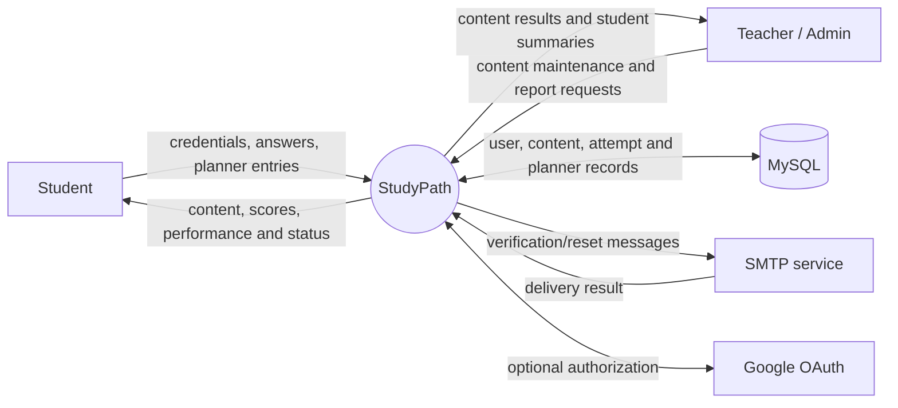
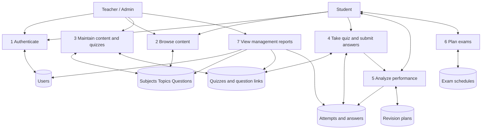
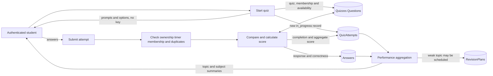

# Data Flow Diagrams and Use Cases

## Context diagram

## Level 1 DFD

## Level 2 DFD: quiz attempt and analysis

## Actors and use cases

Actors are Student; Teacher/Admin (manager role); and optional SMTP/Google providers.

### UC-01 Register

- **Preconditions:** Visitor supplies unused email; database is available.
- **Main flow:** Submit name, email and password; server validates, hashes password and creates a student account, then attempts verification email delivery.
- **Alternates:** Invalid values return validation error; duplicate email conflicts; SMTP failure may leave the account created and return delivery failure.
- **Postconditions:** Student account exists; it becomes verified by following the emailed token link. Public signup cannot select teacher/admin.

### UC-02 Login/logout

- **Preconditions:** Account exists and credentials are valid.
- **Main flow:** Server checks bcrypt hash, sets signed JWT in HttpOnly cookie; `/me` returns public profile; logout clears cookie.
- **Alternates:** Invalid credentials return an error; missing/invalid/expired cookie yields 401 on protected routes.
- **Postconditions:** Auth cookie is set or cleared. Current login does not enforce `emailVerified`.

### UC-03 Maintain learning content

- **Preconditions:** Authenticated teacher/admin.
- **Main flow:** Create/update/delete subjects, topics and questions; validate references and persist.
- **Alternates:** Student gets 403; missing record returns not found; duplicate/invalid data returns an error.
- **Postconditions:** Accepted changes persist. Student topic-question view excludes answer key and explanation.

### UC-04 Take quiz

- **Preconditions:** Authenticated student; quiz published and available.
- **Main flow:** Start attempt; receive questions without correct answers; submit selections; server validates timer, membership and duplicate submissions, scores and stores result.
- **Alternates:** Unpublished quiz or invalid attempt rejected; non-owner cannot access attempt; late answers beyond limit plus transport grace are not scored.
- **Postconditions:** Attempt is completed with server-calculated result and answers.

### UC-05 Review performance and revise

- **Preconditions:** Authenticated student; no-attempt performance is an empty/zero state.
- **Main flow:** Review aggregates; create revision for topic below 50%; complete plan; retake quiz and view comparison.
- **Alternates:** Non-weak topic or duplicate plan rejected; another student's plan inaccessible; comparison explains missing prior/retest attempt.
- **Postconditions:** Owned plan and optional retest comparison are stored.

### UC-06 Schedule exam

- **Preconditions:** Authenticated student and existing subject.
- **Main flow:** Create future exam date; view preparation metrics; edit, complete or delete owned schedule.
- **Alternates:** Invalid/past date, missing subject, duplicate same-subject date or non-owned record is rejected.
- **Postconditions:** Schedule status and dashboard summary update.

### UC-07 View management summaries

- **Preconditions:** Authenticated teacher/admin.
- **Main flow:** View dashboard counts, student listing or one student's performance.
- **Alternates:** Student gets 403; missing student returns not found.
- **Postconditions:** Read-only information is returned without passwords or tokens.
