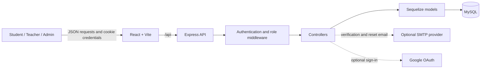

# System Design

## Architecture

StudyPath uses a browser-based React application and a JSON API. The Vite development server serves the frontend and proxies `/api` requests to the Express service. Express applies CORS, cookie parsing, JSON parsing, routing, and centralized error handling. Sequelize maps API persistence operations to MySQL.

The external email and Google integrations require environment credentials. Their live provider handshakes were not verified by the documented regression run.

## Modules

| Module | Responsibility |
|---|---|
| Authentication | Registration, login/logout, current-user lookup, email verification, password reset, optional Google sign-in |
| Learning content | Subject, topic and question browsing and manager maintenance |
| Quizzes | Publication, question association, timed attempts, server scoring and attempt history |
| Performance | Aggregates completed attempts and answers into subject/topic performance groups |
| Revision | Creates weak-topic revision tasks and compares performance after retest |
| Exam planner | Manages exam dates and derives preparation status from performance and revision data |
| Teacher/admin | Dashboard summaries and read-only student performance views |

## Request flow

1. React calls the `/api` Axios client with cookie credentials.
2. Express routes the request; protected routes verify the JWT in the `token` HttpOnly cookie.
3. Role middleware restricts manager and student endpoints.
4. Controllers validate input and ownership, then use Sequelize models.
5. The API returns JSON. Password hashes are excluded from user responses, and student question views omit answer keys and explanations.

## Configuration and limitations

Backend settings include `PORT`, `DB_HOST`, `DB_PORT`, `DB_NAME`, `DB_USER`, `DB_PASSWORD`, `JWT_SECRET`, `CLIENT_URL`; optional SMTP settings are `EMAIL_HOST`, `EMAIL_PORT`, `EMAIL_USER`, `EMAIL_PASSWORD`, `EMAIL_FROM`; optional Google credentials and callback are also supported. Frontend uses `VITE_API_URL`; Vite's proxy target can use `VITE_API_PROXY_TARGET`.

The database uses MySQL and Sequelize. Startup schema helpers are additive compatibility helpers, not a versioned migration framework. Three many-to-many tables are generated by Sequelize; current revision and exam flows instead use direct `topic_id` and `subject_id` fields. Some observed physical foreign key columns are nullable despite stricter model declarations, and `quizzes.topic_id` had no physical FK. See [Database Design](DATABASE_DESIGN.md). The project does not implement a mobile client or AI recommendation engine.
